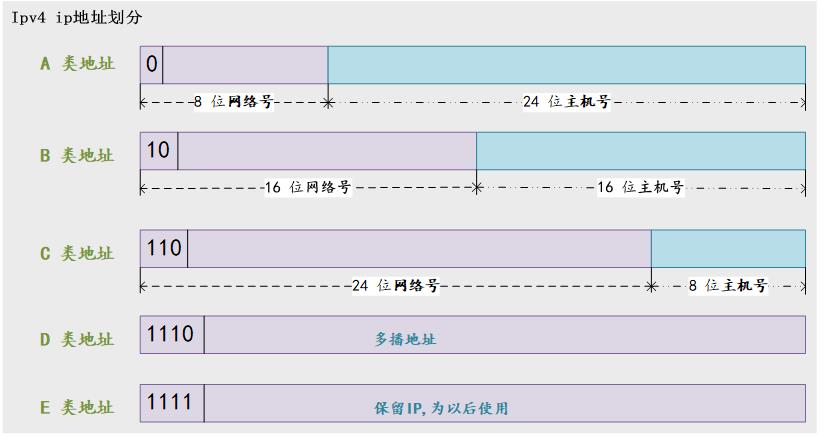

# IP地址知识点总结

## IPV4 IP地址分类

### A 类IP地址

1. 特殊IP地址

    **0.0.0.0、255.255.255.255** 这两个地址作为A类IP地址中的保留地址，通常用来作为DHCP报文中IP层的源IP和目的IP。

    **127.x.x.x/8** 整个127网段的IP都作为环回测试IP地址，所有IP都指向本机。通常我们认为 **127.0.0.1** 是指向本机的
，事实上 127.x.x.x 所有的IP都指向本机。 如果你本机开启一个web服务，那么你在本机可以使用任何 127开头的IP来访问这个
web服务。

2. 特殊IP地址2

    对于每类IP地址，主机号全0，表示本机，作为保留IP。

    对于每类IP地址，主机号全1，表示指向网络的广播IP，作为保留IP。

3. 可用的IP地址

    除去以上的保留IP地址，那么A类地址中可用的IP地址事实上如下范围：

    1.0.0.1/8 ~ 126.255.255.254/8

4. 网络号范围

    1 ~ 126

### B 类IP地址

1. 特殊IP地址
   
   相比较于A类IP，B类IP中只有，主机号全0 和 主机号全1 为保留IP地址，其它都是可用的IP地址

2. 可用的IP地址

    128.0.0.1/16 ~ 191.255.255.254/16

3. 网络号范围

    128 ~ 191

### C 类IP地址

1. 特殊IP地址

    同B类IP地址一样，主机号全0 和 主机号全1 为保留IP地址

2. 可用的IP地址

    192.0.0.1/24 ~ 223.255.255.254/24

3. 网络号范围

    192 ~ 223

### D 类IP地址

D类IP地址，通常作为组播组IP地址，网络号 前4bit固定为 **1110** ，其余28bit不做特殊区分

1. 网络号范围

    224 ~ 239

### E 类IP地址

E类IP地址为实验保留，识别头为 1111 

1. 网络号范围

    240 ~ 255 