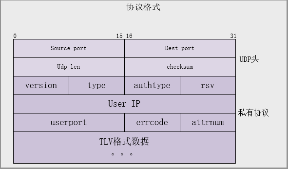

# WireShark 插件开发

通常我们再项目开发中会定义私有的协议，当通过wireshark查看网络数据包时，如果能够
按照我们协议的格式进行显示，并明确显示协议每一位的含义，那将会是很愉快的一件事情，
而不需要再去看网络数据晦涩的二进制。

下面举例介绍一下 **WireShark插件** 的开发方法，带你装逼带你飞~~

## 第一步

想要开发协议插件，首先你要对所开发的协议十分的了解才行。举个例子，下面是我这边的一个私有协议

### 协议格式

### 协议字段说明

+ versions : 协议版本，1字节，取值 0 或者 1
+ type : 消息类型，1字节
	+ [1] :  Challenge-Request
	+ [2] :  Challenge-Ack
	+ [3] :  Auth-Request
	+ [4] :  Auth-Ack
	+ [5] :  Logout-Request
	+ [6] :  Logout Ack
	+ [7] :  Auth-AFF-Ack
	+ [8] :  NTF-Logout-Request
	+ [9] :  Ask-Info-Request
	+ [10] : Ask-Info-Ack
	+ [14] : NTF-Logout-Ack
+ authtype : 认证类型，1字节

## 第二步