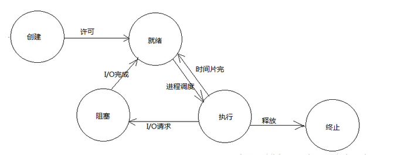
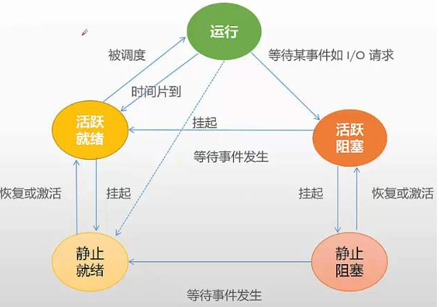

# 操作系统考点总结

## 操作系统概念性知识

1. 操作系统定义
2. 操作系统功能
3. 操作系统分类

## 进程管理

1. 什么是前趋图？
  
    前趋图的表示通常使用 '→' 箭头来表示，例如：P1 → P2 。 那么我们将，P1是P2的前驱，P2是P1的后继。 只有当
    P1执行完成之后，P2才能够执行。前趋图是个很重要的考点，所以要能看懂图

2. 进程的组成
   * 程序 （程序描述了进程完成的功能）
   * 数据 （进程运行时所需的资源，这个资源是该进程独有的）
   * 控制块（PCB） PCB是进程存在的唯一标志（操作系统执行进程的时候，会给每个执行的进程维护一个PCB，来记录这个进程的相关信息）
3. 进程的执行
   
   只有当一个进程同时获取到了 **所需的资源** 和 **CPU** 时，这个进程才能执行

4. 进程的状态
   * 三态模型
        - 运行 （进程拥有资源和CPU，处理运行中）
        - 就绪 （进程拥有资源，但没有CPU，处于就绪状态）
        - 阻塞 （进程在等待一个资源的到来，处于阻塞状态）

        - 如图：

            

   * 五态模型 （相对于三态模型，多了**新建态**和**终止态**）
        - 如图：

            
   * 更详细的状态模型
        - 活跃就绪 （进程在主存，并且处于可调度状态）
        - 静止就绪 （进程在辅存，必须先转换为活跃就绪才能被调度）
        - 活跃阻塞 （进程阻塞，但一旦解阻塞立马进入活跃就绪状态）
        - 静止阻塞 （进程阻塞，解阻塞后必须先进入活跃阻塞才能进入活跃就绪状态被调度）
        - 如图：

            

## 进程控制

1. 什么叫进程原语？
   
   由若干条机器指令组成，用于完成特定功能，在执行时不能被分割的原子操作。

2. 同步和互斥的概念
3. PV操作
   * P操作 （S = S - 1，若S >= 0 ,则执行P操作的进程继续执行；如果S < 0 ，则设置该进程为阻塞状态，将其插入阻塞队列）
   * V操作 （S = S + 1，若S > 0，则执行V操作的进程继续执行；如果S <= 0 ，则从阻塞状态唤醒一个进程加入就绪队列，然后执行V操作的进程继续执行）
4. 生产者消费者模型
5. 进程调度
6. 死锁
7. 线程

## 存储管理