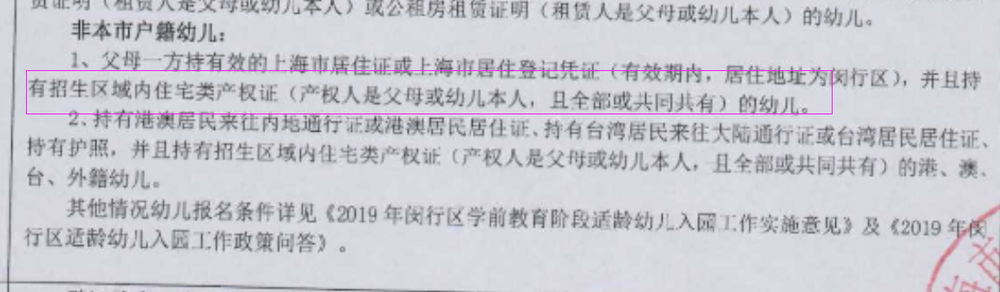
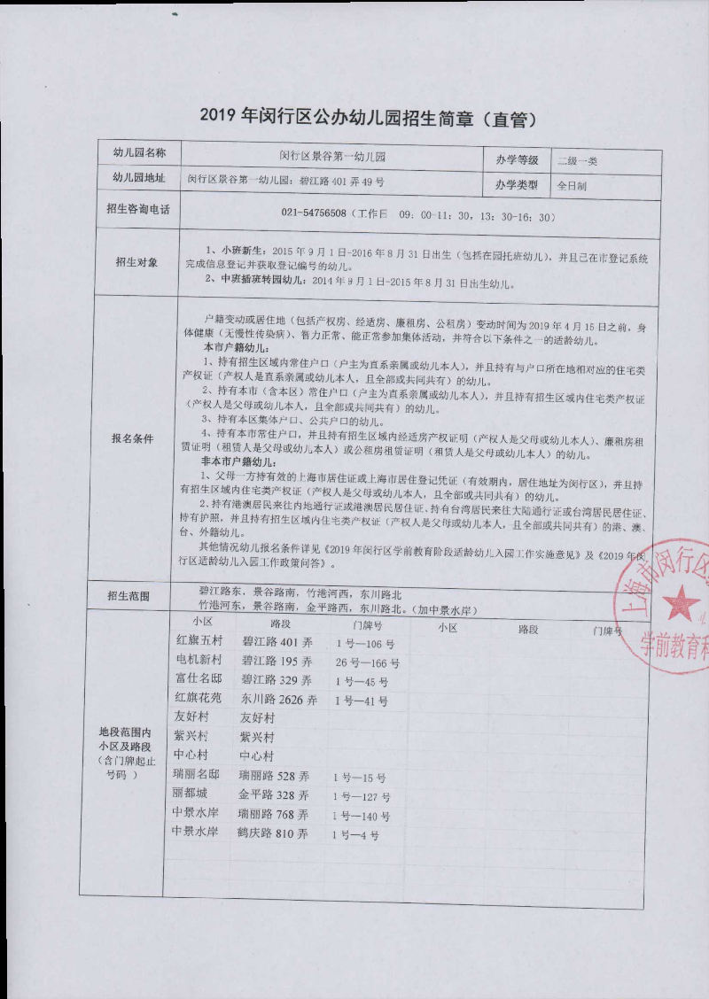
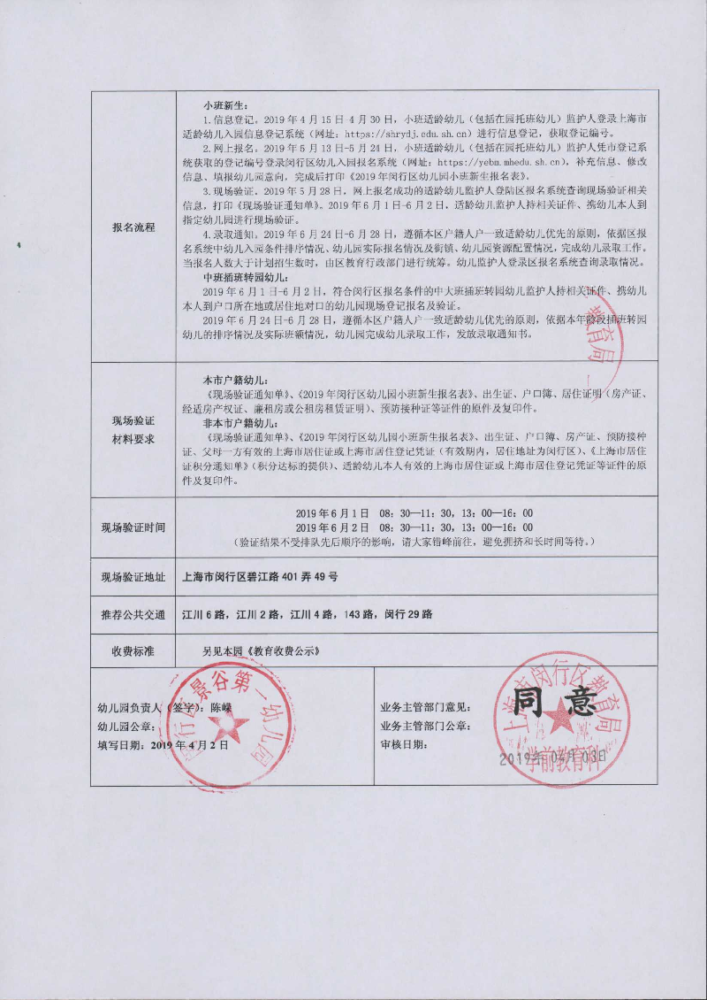
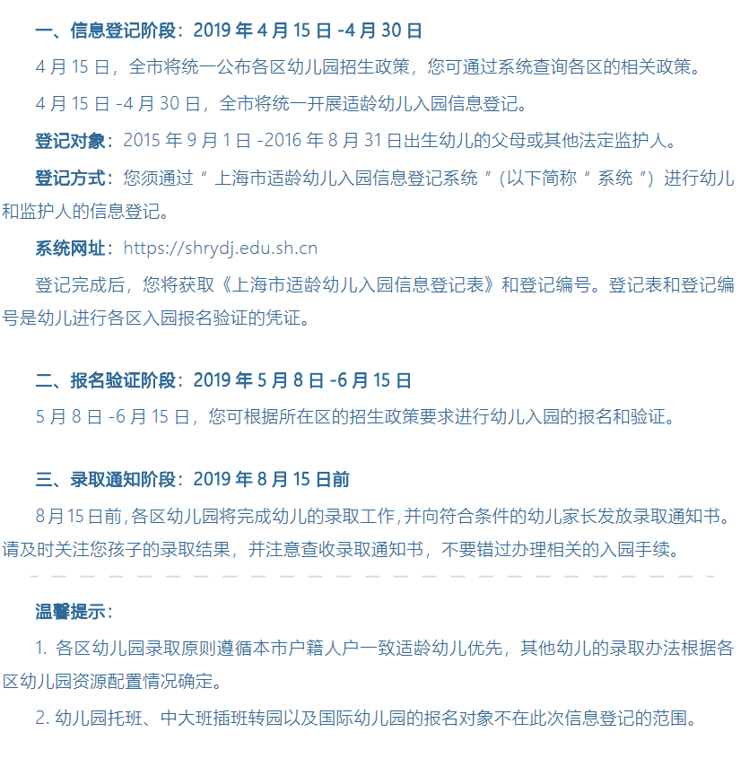

# 非沪籍上海幼儿园入园攻略

>眨眼功夫，女儿已经2岁3个月了，明年就该上幼儿园了。作为一枚沪漂，儿女的上学问题始终是我们作为家长首要关心的大事，应该提早准备起来，切勿错失在沪的各种政策，做到心中有数。

## 非沪籍入园条件

* 幼儿和监护人 持有上海市居住证或上海市居住登记凭证

## 闵行区教育相关政策查询 -- 请持续关注...

1. 官网查询 http://www.mhedu.sh.cn/  （注意：请使用谷歌浏览器打开）
    * 注意： 上面这个网址什么都可以查，包括（招生政策，幼、小、中学，学校以及对口的小区等信息，以及每个学校的入校条件等）

## 我关心的幼儿园
   * 闵行区景谷第一幼儿园
        - 地址： 上海市闵行区碧江路401弄49号
        - 办园等级：市二级一类园
        - 举办者类型：局管
        - 幼儿园官网：http://www.mhedu.sh.cn/school/347.htm
        - 对口小区： 总园为小班中班部 碧江路401弄(红旗五村) 碧江路195弄(电机新村) **碧江路329弄(富仕名邸)** 东川路2626弄(红旗花苑) 友好村 紫兴村 中心村
        - 招生条件：

            

        - 招生简章：

            

            

## 2019闵行区入园步骤 （作为2020的参考）

1. 信息登记
   * 时间：4月15日 - 4月30日
   * 网址：https://shrydj.edu.sh.cn/
   * 注意事项：完成登记会获取一个登记编号，这个编号会作为后续登录“闵行区幼儿入园报名系统”的密码，所以务必牢记！！！
2. 网上报名阶段
   * 时间：5月13日 - 5月24日
   * 网址：https://yebm.mhedu.sh.cn/
   * 报名准备材料
        - 孩子近期正面免冠证件照片（像素272x354，jpg格式），电子档、纸质档
        - 孩子户口簿原件连续页清晰照片（首页至最后一页，jpg格式，单张小于300k）？ （是不是把户口簿所有页整到一张照片上？ 待确认）
        - 非本市户籍幼儿父母一方居住证清晰粘片（正反面，jpg格式，单张小于300k）
        - 意向报名的 幼儿园 （这个是重点，要事先了解清楚的） 
3. 现场验证阶段
   * 第一批 时间：6月1日 - 6月2日  （最好在第一批就确定能录取，到第二批就被统筹了，那就不是想去哪去哪了）
   * 第二批 时间：6月15日
4. 发放录取通知
   * 时间：6月24日 - 6月28日

5. 上海市2019入园官方政策

    

6. 闵行区2019入园官方政策

    [2019闵行官方入园政策](http://www.mhedu.sh.cn/gk/qsksxxgk/qkxx/yewqs/qszc/231755.htm)